# E-commerce

An E-Commerce web app for all kind of products where vendors can add, view, edit and delete their products and can increase their business to a wide range of customers through this online web application.

# Features:

#### Sign up page
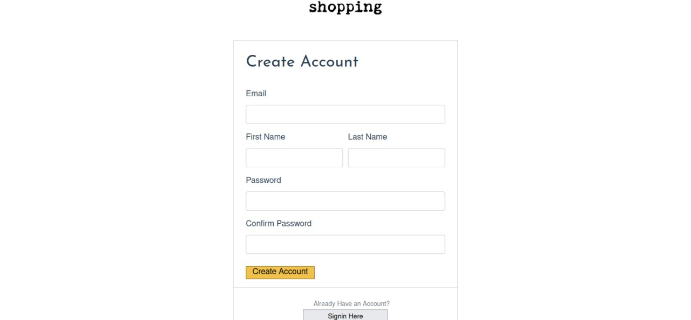

#### Sign in page
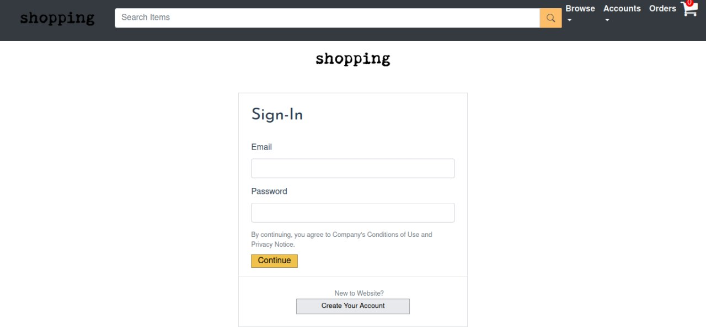

#### Admin dashboard with multiple features
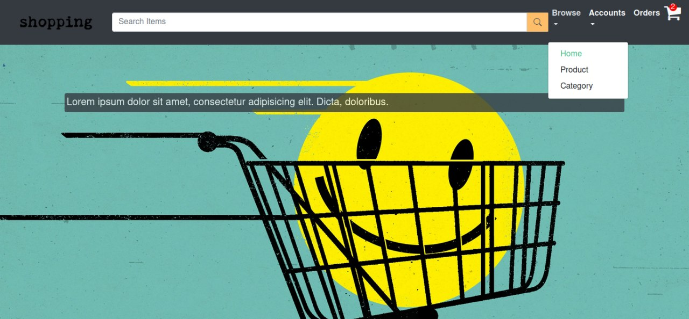

#### Top Categories
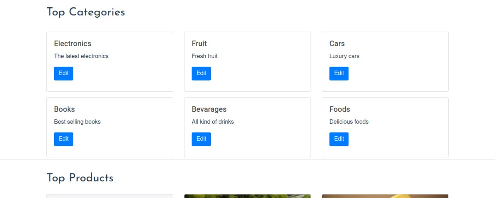

#### Top Products
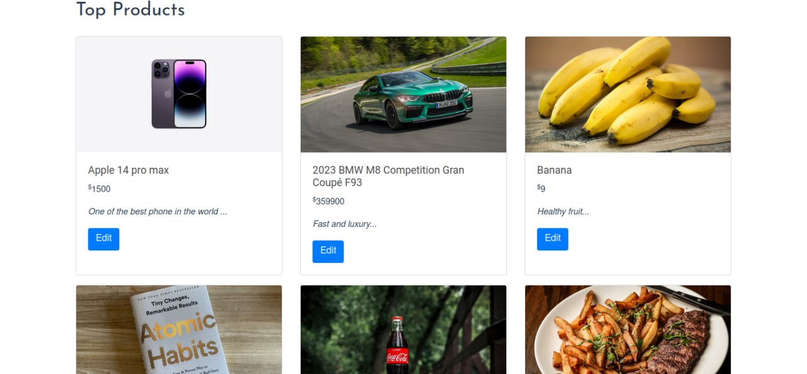

#### Footer part
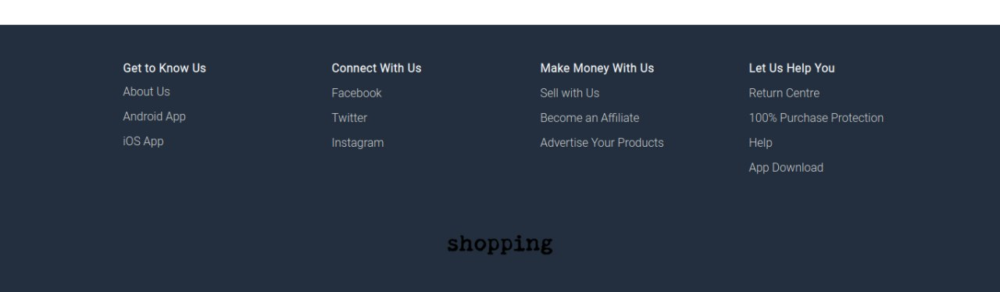

#### All Categories and Total Products in each category
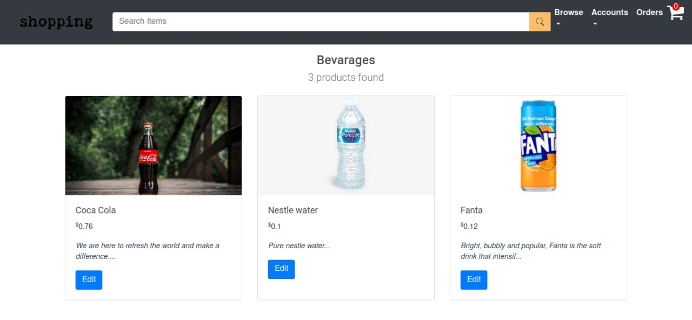

#### Description for each Product
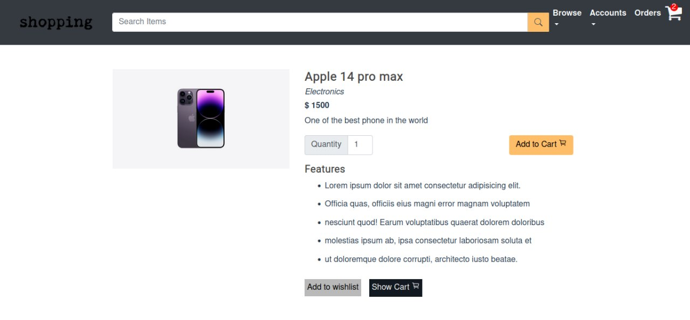

#### Wishlist 
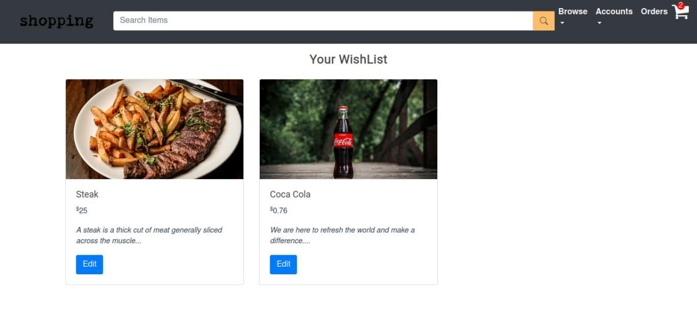

#### Making payment 
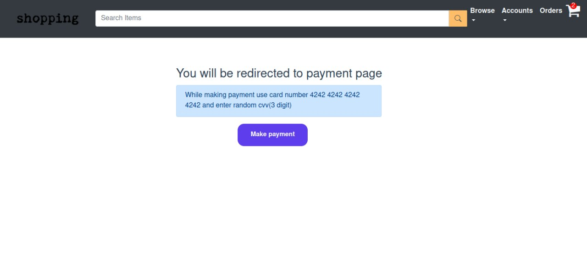

#### Stripe payment page
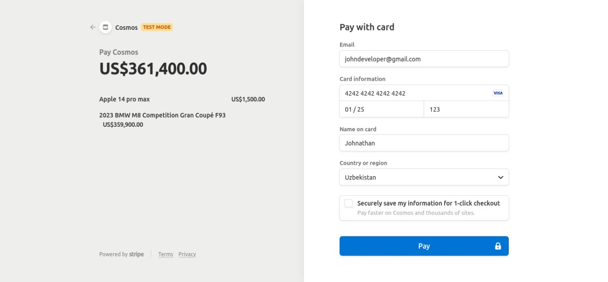

# Other Features
    - Authentication System
    - Admin Dashboard - where he can
          * Manage all categories
          * Manage all Orders
          * Manage all Products
    - Contact Page 

# Tech
    - HTML
    - CSS
    - Bootstrap
    - Vue Js
    - Axios
